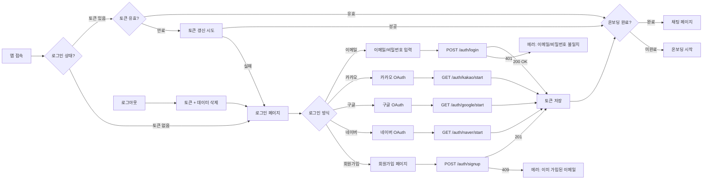

# 인증 플로우

## FigJam
https://www.figma.com/online-whiteboard/create-diagram/57e65d25-23b8-4efa-b957-ab505646fa4e

## Flowchart

```mermaid
flowchart LR
    A["앱 접속"] --> B{"로그인 상태?"}
    B -->|"토큰 있음"| C{"토큰 유효?"}
    B -->|"토큰 없음"| D["로그인 페이지"]
    C -->|"유효"| E{"온보딩 완료?"}
    C -->|"만료"| F["토큰 갱신 시도"]
    F -->|"성공"| E
    F -->|"실패"| D
    D --> G{"로그인 방식"}
    G -->|"이메일"| H["이메일/비밀번호 입력"]
    G -->|"카카오"| I["카카오 OAuth"]
    G -->|"구글"| J["구글 OAuth"]
    G -->|"네이버"| K["네이버 OAuth"]
    G -->|"회원가입"| L["회원가입 페이지"]
    H --> M["POST /auth/login"]
    I --> N["GET /auth/kakao/start"]
    J --> O["GET /auth/google/start"]
    K --> P["GET /auth/naver/start"]
    L --> Q["POST /auth/signup"]
    M -->|"200 OK"| R["토큰 저장"]
    N --> R
    O --> R
    P --> R
    Q -->|"201"| R
    M -->|"401"| S["에러: 이메일/비밀번호 불일치"]
    Q -->|"409"| T["에러: 이미 가입된 이메일"]
    R --> E
    E -->|"완료"| U["채팅 페이지"]
    E -->|"미완료"| V["온보딩 시작"]
    W["로그아웃"] --> X["토큰 + 데이터 삭제"]
    X --> D
```
