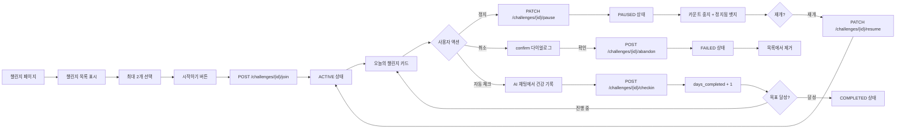

# 챌린지 플로우

## FigJam
https://www.figma.com/online-whiteboard/create-diagram/dad09d59-db8e-45bd-b906-f6c9e5a79829

## Flowchart

```mermaid
flowchart LR
    A["챌린지 페이지"] --> B["챌린지 목록 표시"]
    B --> C["최대 2개 선택"]
    C --> D["시작하기 버튼"]
    D --> E["POST /challenges/{id}/join"]
    E --> F["ACTIVE 상태"]
    F --> G["오늘의 챌린지 카드"]
    G --> H{"사용자 액션"}
    H -->|"정지"| I["PATCH /challenges/{id}/pause"]
    I --> J["PAUSED 상태"]
    J --> K["카운트 중지 + 정지됨 뱃지"]
    K --> L{"재개?"}
    L -->|"재개"| M["PATCH /challenges/{id}/resume"]
    M --> F
    H -->|"취소"| N["confirm 다이얼로그"]
    N -->|"확인"| O["POST /challenges/{id}/abandon"]
    O --> P["FAILED 상태"]
    P --> Q["목록에서 제거"]
    H -->|"자동 체크"| R["AI 채팅에서 건강 기록"]
    R --> S["POST /challenges/{id}/checkin"]
    S --> T["days_completed + 1"]
    T --> U{"목표 달성?"}
    U -->|"달성"| V["COMPLETED 상태"]
    U -->|"진행 중"| G
```
