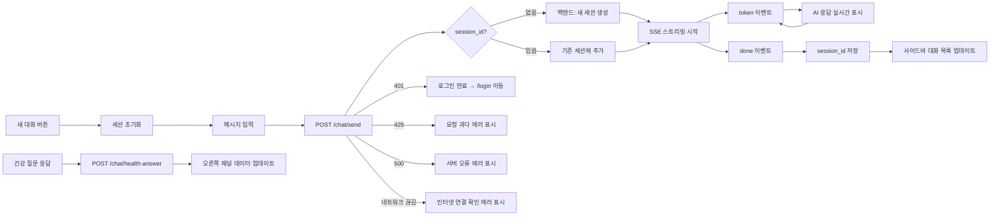

# 채팅 플로우

## FigJam
https://www.figma.com/online-whiteboard/create-diagram/066b3be1-2fa4-4a55-8b0e-aade14fa8e02

## Flowchart

```mermaid
flowchart LR
    A["메시지 입력"] --> B["POST /chat/send"]
    B --> C{"session_id?"}
    C -->|"없음"| D["백엔드: 새 세션 생성"]
    C -->|"있음"| E["기존 세션에 추가"]
    D --> F["SSE 스트리밍 시작"]
    E --> F
    F --> G["token 이벤트"]
    G --> H["AI 응답 실시간 표시"]
    H --> G
    F --> I["done 이벤트"]
    I --> J["session_id 저장"]
    J --> K["사이드바 대화 목록 업데이트"]
    B -->|"401"| L["로그인 만료 → /login 이동"]
    B -->|"429"| M["요청 과다 에러 표시"]
    B -->|"500"| N["서버 오류 에러 표시"]
    B -->|"네트워크 끊김"| O["인터넷 연결 확인 에러 표시"]
    P["새 대화 버튼"] --> Q["세션 초기화"]
    Q --> A
    R["건강 질문 응답"] --> S["POST /chat/health-answer"]
    S --> T["오른쪽 패널 데이터 업데이트"]
```
