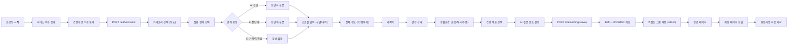

# 온보딩 플로우

## FigJam
https://www.figma.com/online-whiteboard/create-diagram/9b2024be-7780-4d07-a8f1-97595225b10d

## Flowchart

```mermaid
flowchart LR
    A["온보딩 시작"] --> B["서비스 이용 동의"]
    B --> C["건강정보 수집 동의"]
    C --> D["POST /auth/consent"]
    D --> E["카테고리 선택 (당뇨)"]
    E --> F["질환 관계 선택"]
    F --> G{"관계 유형"}
    G -->|"A: 진단"| H["진단자 설문"]
    G -->|"B: 전단계"| I["전단계 설문"]
    G -->|"C: 가족력/관심"| J["일반 설문"]
    H --> K["프로필 입력 (성별/나이)"]
    I --> K
    J --> K
    K --> L["신체 정보 (키/몸무게)"]
    L --> M["가족력"]
    M --> N["건강 상태"]
    N --> O["생활습관 (운동/식사/수면)"]
    O --> P["건강 목표 선택"]
    P --> Q["AI 질문 빈도 설정"]
    Q --> R["POST /onboarding/survey"]
    R --> S["BMI + FINDRISC 계산"]
    S --> T["위험도 그룹 배정 (A/B/C)"]
    T --> U["완료 페이지"]
    U --> V["채팅 페이지 진입"]
    V --> W["튜토리얼 자동 시작"]
```
