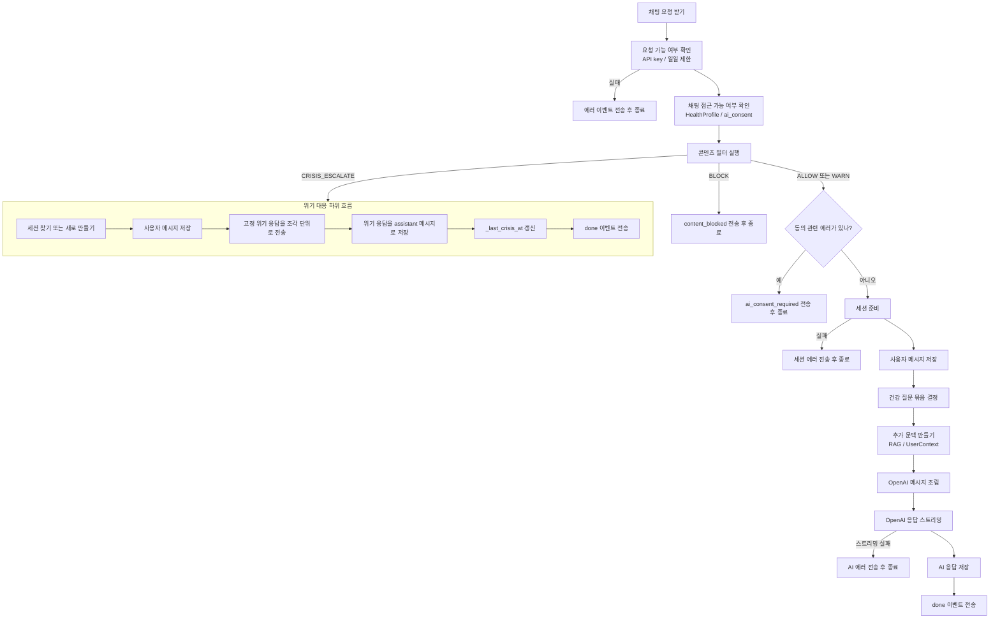

# 채팅 멘토링 후속 검토

## 한 줄 요약
- 이번 라운드는 `문서화 -> 기준선 고정 -> 작은 내부 분리`까지만 진행한다.
- `LangGraph`, `normalize option C`, `chat.py 패키지 전환`, `reason_codes enum 전환`은 이번 범위에서 제외한다.

## 개발 안전 체크리스트 적용 요약
- 변경 목적과 성공 기준:
  - `chat.py` 흐름과 `content_filter.py` 우선순위를 문서로 고정하고, 외부 계약을 유지한 채 내부 가독성을 높인다.
- 영향 범위:
  - 문서: `docs/setup`, `docs/ARCHITECTURE.md`, `docs/DOCUMENT_REGISTRY.md`
  - 백엔드 내부 구현: `backend/services/content_filter.py`, `backend/services/chat.py`
  - 테스트 기준선 확인: `backend/tests/unit/test_content_filter.py`, `backend/tests/unit/test_chat_service_routing.py`
- 현재 SoT:
  - 채팅 전체 흐름 기준: `backend/services/chat.py`
  - 필터 우선순위와 라우팅 기준: `backend/services/content_filter.py`
- DB/API 계약 영향:
  - 없음
- 고위험 변경 제외:
  - 스키마 변경 없음
  - 공개 API 변경 없음
  - normalize 동작 변경 없음
  - LangGraph 도입 없음

## 이번 라운드에서 유지/보류할 것
### 유지
- `send_message_stream` 실제 흐름을 Mermaid로 정리
- `content_filter.check_message` 우선순위와 경로 분류/감정 우선 판정을 표로 정리
- `content_filter` 상수/패턴 1차 분리
- `chat.py`의 작은 헬퍼 추출과 주석 정리

### 보류
- `reason_codes: list[str] -> enum/set`
- `normalize option C`
- `backend/services/chat/` 패키지 전환
- `backend/services/content_filter/` 패키지 전환
- `LangGraph` 도입

## 현재 동작 순서도
### `chat.py`의 `send_message_stream()`

## 주요 함수 한글 설명
### `chat.py`
| 함수 이름 | 쉬운 설명 |
|---|---|
| `send_message_stream()` | 사용자가 보낸 한 메시지를 받아서, 검사하고, 저장하고, AI 응답을 보내는 전체 흐름을 지휘하는 메인 함수 |
| `_validate_request()` | API key, 오늘 사용량 같은 기본 조건을 확인하는 함수 |
| `_validate_chat_access()` | 사용자의 동의 상태와 건강 프로필 존재 여부를 확인하는 함수 |
| `_handle_crisis()` | 위기 표현이 감지됐을 때 OpenAI 대신 고정 위기 응답으로 처리하는 함수 |
| `_prepare_session()` | 기존 세션을 이어 쓸지, 새 세션을 만들지 결정하는 함수 |
| `_build_openai_messages()` | OpenAI에 보낼 최종 프롬프트와 대화 기록을 조립하는 함수 |
| `_stream_openai()` | OpenAI 답변을 한 번에 다 받지 않고 조금씩 스트리밍하는 함수 |
| `_save_response()` | 최종 AI 응답을 DB에 저장하는 함수 |
| `_build_done_data()` | 프론트에 마지막으로 보낼 `done` 데이터를 만드는 함수 |
| `_should_run_rag()` | 지금 메시지에 RAG 검색을 붙일지 판단하는 함수 |
| `_should_build_user_context()` | 지금 메시지에 사용자 맥락을 붙일지 판단하는 함수 |

### `content_filter.py`
| 함수 이름 | 쉬운 설명 |
|---|---|
| `check_message()` | 한 문장을 받아 최종 필터 결과를 만드는 입구 함수 |
| `_check_medical_safety()` | 위기 표현인지, 복약 중단 의도인지 같은 의료 안전 위험을 판정하는 함수 |
| `_check_expression()` | 욕설, 좌절감 같은 표현 문제를 판정하는 함수 |
| `_merge_results()` | 표현 판정과 의료 안전 판정을 우선순위에 따라 하나로 합치는 함수 |
| `_classify_routing()` | 메시지를 `HEALTH_SPECIFIC`, `HEALTH_GENERAL`, `LIFESTYLE_CHAT` 중 하나로 나누는 함수 |
| `_normalize_text()` | 제로 너비 문자 제거와 유니코드 정규화를 수행하는 함수 |

## 분기별 부수효과
| 분기 | DB 저장 | 메모리 갱신 | OpenAI 호출 |
|---|---|---|---|
| API key 실패 | 없음 | 없음 | 없음 |
| 일일 제한 | 없음 | 없음 | 없음 |
| `CRISIS_ESCALATE` | USER + ASSISTANT 저장 | `_last_crisis_at[user_id]` 갱신 | 없음 |
| `BLOCK` | 없음 | 없음 | 없음 |
| `ai_consent` 거부 | 없음 | 없음 | 없음 |
| 세션 준비 실패 | 없음 | 없음 | 없음 |
| 정상 흐름 | USER + ASSISTANT 저장 | 없음 | 스트리밍 호출 |

## `content_filter` 판단표
### 판정 우선순위
| 우선순위 | 조건 | 표현 판정 | 의료 안전 판정 | 사용자에게 직접 보여줄 메시지 | 프롬프트 지시문 |
|---|---|---|---|---|---|
| 1 | 위기 의도 감지 + 관용구 아님 | 유지 | `CRISIS_ESCALATE` | `CRISIS_RESPONSE` | 없음 |
| 2 | 심한 욕설 | `BLOCK` | 유지 | `BLOCK_RESPONSE` | 없음 |
| 3 | 복약/치료 중단 의도 선포 | 유지 | `MEDICAL_NOTE` | 없음 | `MEDICAL_NOTE_PROMPT_INSTRUCTION` |
| 4 | 건강 좌절감 | `WARN` | 유지 | 없음 | `WARN_PROMPT_INSTRUCTION` |
| 5 | 그 외 | `ALLOW` 또는 기존값 유지 | `NONE` 또는 기존값 유지 | 없음 | 없음 |

### 경로 분류 규칙
| 조건 | 내부 경로값 | 한글 의미 | 감정 우선 플래그 |
|---|---|---|---|
| `MEDICAL_NOTE` 이거나 specific 패턴 매칭 | `HEALTH_SPECIFIC` | 혈당 수치, 약, 증상처럼 구체적인 건강 질문 | 별도 판정 |
| general 패턴 매칭 | `HEALTH_GENERAL` | 운동, 식단, 수면처럼 일반 건강 질문 | 별도 판정 |
| 그 외 | `LIFESTYLE_CHAT` | 일반 잡담이나 생활 대화 | 별도 판정 |
| `health_frustration` reason 보유 | route와 독립 | 경로와 무관 | `True` |
| `ROUTING_EMOTION_PATTERNS` 매칭 | route와 독립 | 경로와 무관 | `True` |

## 테스트 기준선 고정
### 실제 확인 결과
| 대상 | 명령 | 결과 |
|---|---|---|
| content filter unit | `uv run python -m pytest backend/tests/unit/test_content_filter.py -q` | `63 passed` |
| chat routing unit | `uv run python -m pytest backend/tests/unit/test_chat_service_routing.py -q` | `9 passed` |

### 이번 라운드 기준
- 위 두 테스트 결과를 현재 행동 패리티 기준선으로 사용한다.
- normalize 강화나 enum 전환 같은 행동 변경은 다음 라운드에서 별도 golden set을 만든 뒤 진행한다.

## 이번 라운드 구현 범위
1. `content_filter` 상수/패턴을 별도 모듈로 추출하되 공개 import surface는 유지한다.
2. `chat.py`에서 아래 세 축만 읽기 쉽게 정리한다.
   - `_should_run_rag()`
   - `_should_build_user_context()`
   - `_build_openai_messages()`
3. `ARCHITECTURE.md`에는 LangGraph를 `현재 비도입`으로만 짧게 기록한다.
4. `DOCUMENT_REGISTRY.md`에는 이 문서를 등록한다.

## LangGraph 현재 판단
- 현재 `chat.py`는 선형 오케스트레이션 + early return + 선택적 enrichment 구조다.
- 지금 당장 해결해야 하는 핵심 문제는 그래프 부재보다:
  - 현재 흐름이 문서화되어 있지 않다는 점
  - `content_filter` 규칙/우선순위가 한 파일에 밀집해 있다는 점
  - 회귀 기준선이 문서와 코드 양쪽에서 약하다는 점
- 따라서 이번 라운드에서는 `LangGraph 비도입`으로 기록하고, 후속 재검토 조건만 남긴다.

## 용어를 더 쉽게 풀면
| 코드 용어 | 쉬운 한국어 설명 |
|---|---|
| `route` | 이 메시지를 어떤 종류의 대화로 볼지 정하는 내부 분류값 |
| `emotional_priority` | 건강 질문보다 공감과 감정 대응을 먼저 해야 하는지 나타내는 표시 |
| `RAG` | 외부 지식이나 문서를 검색해서 답변에 참고 자료를 붙이는 방식 |
| `UserContext` | 사용자의 과거 생활습관 맥락을 짧게 정리한 참고 정보 |
| `prompt instruction` | AI가 답할 때 꼭 지켜야 하는 추가 지시문 |
| `side effect` | 함수가 값을 계산하는 것 외에 실제 저장, 전송, 상태 변경까지 일으키는 효과 |

## 후속 라운드 후보
- branch parity 테스트 추가
- normalize 우회 golden set 수집
- `reason_codes` 타입 전환 검토
- `chat.py` 단계형 오케스트레이터 전환 검토
