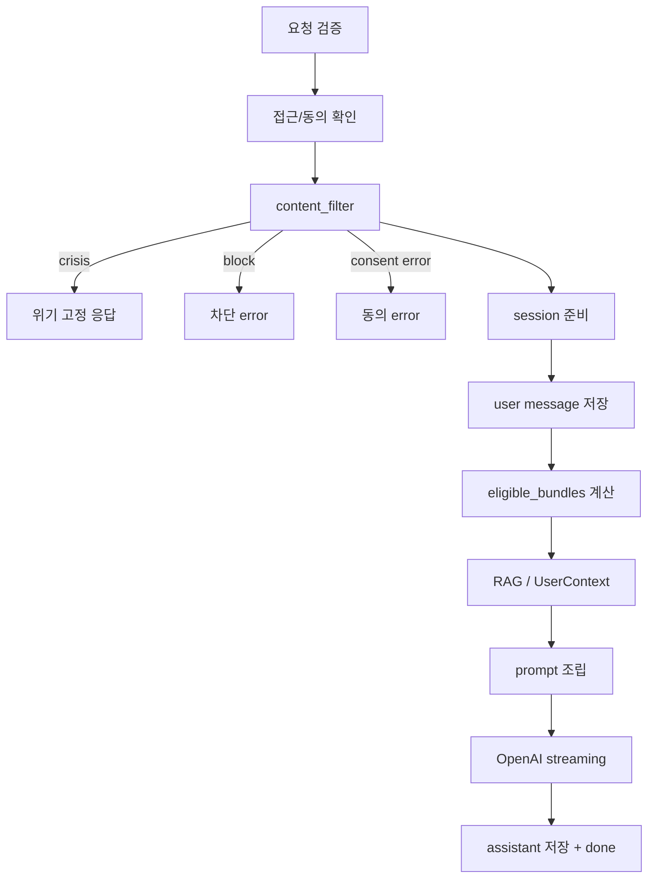
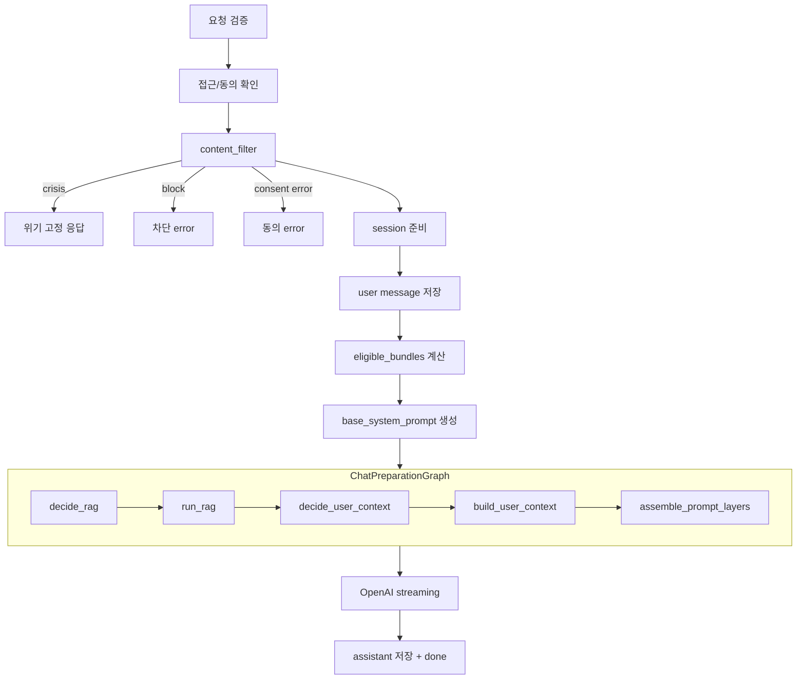

# 채팅 흐름 전후 비교

## 현재 흐름

## LangGraph 부분 적용 후

## 소유권 구분
- legacy-owned:
  - validation
  - access/consent
  - content_filter
  - session/message 저장
  - eligible_bundles
  - OpenAI streaming
  - done payload
- graph-owned:
  - RAG
  - UserContext
  - prompt layers
- never-graph:
  - crisis/block/consent early return
  - `_last_crisis_at`
  - SSE contract
